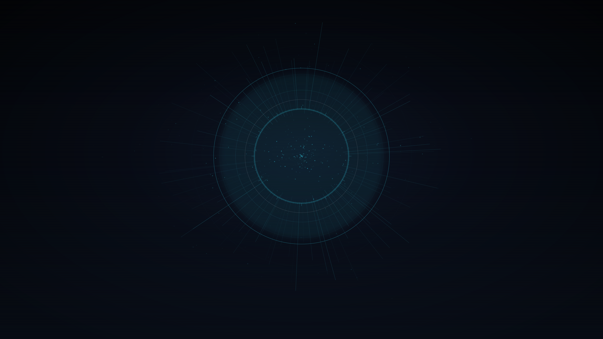

# Sword Art Omarchy

An [Omarchy](https://omarchy.org/) theme inspired by Sword Art Online's
holographic "Link Start" menu UI — near-black navy backgrounds with a bright
cyan-blue accent, the way the game's system windows glow against the dark.



## Install

```bash
omarchy theme install https://github.com/KitsuneSemCalda/Sword-Art-Omarchy
omarchy theme set "Sword Art Omarchy"
```

## Palette

| | |
|---|---|
| Background | `#070b14` |
| Panel | `#101a2c` |
| Accent (cyan) | `#39e6ff` |
| Foreground | `#eaf6ff` |
| HP (red) | `#ff3b5c` |
| MP (blue) | `#4f8dff` |

Icons: `Yaru-blue-dark`.

## Backgrounds

- `1-link-start.png` — the ring-burst "Link Start" login moment
- `2-hud-grid.png` — a calmer daily-driver wallpaper with a faint hex-grid HUD
- `3-status-panel.png` — inventory/menu-panel composition with HP/MP bars

All backgrounds and UI marks are original, generated artwork — no frames or
art from the anime were used.
