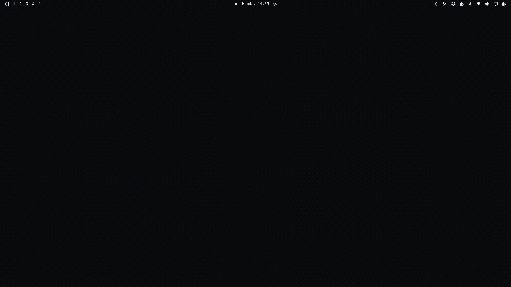
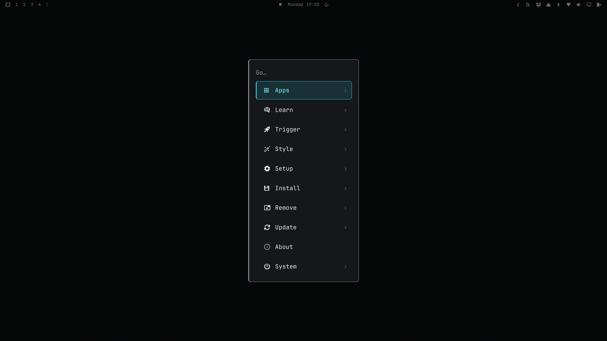
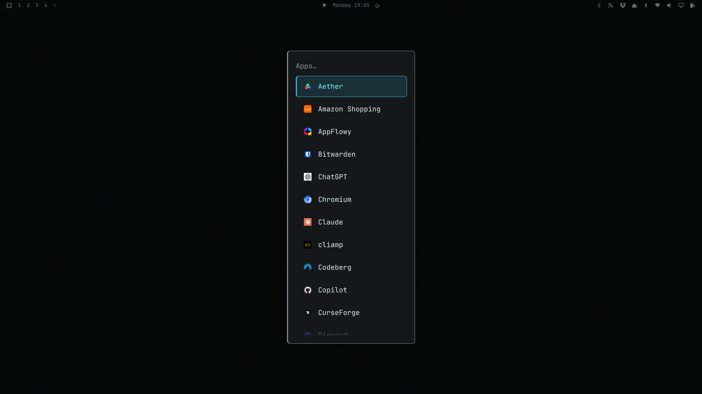
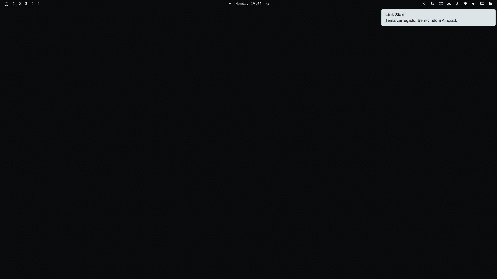
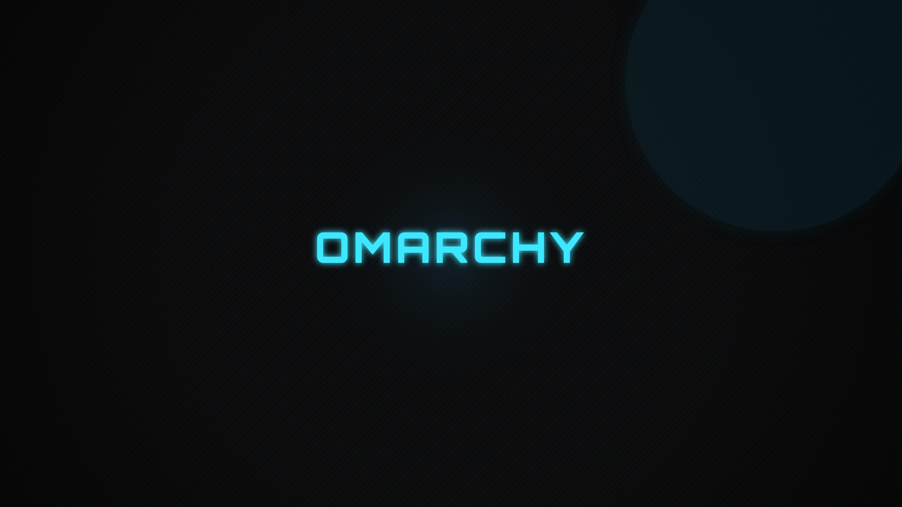

# Sword Art Omarchy

An [Omarchy](https://omarchy.org/) theme inspired by Season 1 of Sword Art
Online — the black leather-and-steel look of Aincrad's system windows:
carbon-black backgrounds textured like a woven coat, with the bright
cyan-blue "Link Start" glow burning through the dark.

## System interface

`shell.toml` adds an Aincrad-inspired interface to Omarchy versions with
support for shell surface themes:

- Pale, translucent notification cards and tooltips with dark text.
- Thin borders with a stronger left edge on menus, launcher, and popups.
- Cyan hover, keyboard focus, and selection treatments on dark controls.
- An HP-inspired green notification lifetime indicator; critical alerts
  retain their red urgency color.

The terminal palette and carbon wallpapers stay dark. The interface screenshots below show the applied theme; the background
previews in the Backgrounds section show wallpaper artwork.
Shell geometry follows Omarchy's components; this theme does not add custom
HUD widgets or change window-manager settings.

## Interface screenshots

Captured on Omarchy **4.0.3-1**, at **1920×1080**, with the repository's
`shell.toml` applied. The local shell override sets `[font] base-size = 14`;
bar layout and installed applications reflect the capture machine.

| Desktop and bar | Main menu |
|---|---|
|  |  |

| Application launcher | Demonstration notification |
|---|---|
|  |  |

These captures show the desktop, menu selection, launcher, and normal
notification surface. Critical urgency, tooltips, and the lifetime animation
still require separate visual verification.

## Install

This theme targets **Omarchy 4 (Quattro)** and its Quickshell interface.
The shell tokens were checked against the installed **4.0.3-1** source;
that is the compatibility reference, not a claim that every earlier 4.x
release was tested. Omarchy 3 and older are not supported by this package.
See the [upstream Quattro overview](https://github.com/omacom/omarchy/pull/6231)
for the shell transition, and [COMPATIBILITY.md](COMPATIBILITY.md) for
which Omarchy versions have actually been checked.

Check your installed version with `omarchy version`, then install:

```bash
omarchy theme install https://github.com/KitsuneSemCalda/Sword-Art-Omarchy
omarchy theme set "Sword Art Omarchy"
```

The application launcher shares the `[menu]` surface in `shell.toml`.
Machine-wide overrides in `~/.config/omarchy/shell.toml` take precedence
over theme values and can change the appearance.

## Palette

| | |
|---|---|
| Background | `#08090a` |
| Panel | `#16181b` |
| Accent (cyan) | `#3ee8ff` |
| Foreground | `#e9f2f5` |
| HP (red) | `#ff3b5c` |
| MP (blue) | `#4f8dff` |

Icons: `Yaru-blue-dark`.

## Backgrounds

Three 4K wallpapers — carbon-fiber texture only, no HUD elements, no
text. Just the material and a hint of ambient light, so icons and
windows stay legible on top.

<table>
<tr>
<td width="33%">


**`1-ember.png`**
A quiet cyan glow low in the corner.

</td>
<td width="33%">


**`2-horizon.png`**
The same glow, opposite corner.

</td>
<td width="33%">


**`3-void.png`**
No glow at all — pure carbon.

</td>
</tr>
</table>

`backgrounds/omarchy.png` is the wordmark wallpaper included in the theme's
background rotation, and `unlock.png` is the small logo mark shown on the
Plymouth unlock screen — both share the same carbon/cyan treatment.

`preview.png` and `preview-unlock.png` are compact selector previews derived
from the same artwork. They keep the theme visible in both the main Omarchy
theme picker and the Plymouth unlock-screen picker without loading the full
4K wallpapers.



All backgrounds and UI marks are original, generated artwork — no frames or
art from the anime were used.

## Fan project

Sword Art Omarchy is an unofficial, non-commercial fan project. It is not
affiliated with, endorsed by, or produced in association with Reki
Kawahara, ASCII Media Works, A-1 Pictures, Aniplex, or any other rights
holder of the *Sword Art Online* franchise. "Sword Art Online," "Aincrad,"
and related names and marks are trademarks of their respective owners,
used here only to describe the visual inspiration for this theme. This
repository distributes only original artwork and configuration files, and
grants no rights to any *Sword Art Online* trademark or copyrighted asset.

## Development

Run the package checks locally with **Python 3.11+**, **ImageMagick**,
and **ShellCheck** installed:

```bash
shellcheck tests/validate-theme.sh
python3 -m unittest discover -s tests -p 'test_*.py'
bash tests/validate-theme.sh
```

GitHub Actions runs the same validation on every push and pull request.
The checks cover TOML parsing, the semantic palette, required shell sections,
unknown keys, color formats, alpha ranges, border widths, and image formats.
The shell validator covers the subset used by this theme; extend its schema
when adding new supported Omarchy tokens.

### Visual verification

Automated checks do not verify rendering. The interface screenshots above
record the captured states; the artwork previews are not UI evidence.
Before adding screenshots or publishing a visual update:

1. Apply the repository version of the theme and record `omarchy version`.
2. Check the bar, application launcher, menus, and popups, including mouse
   hover, keyboard focus, and selected items.
3. Check normal and critical notifications: pale cards, legible dark text,
   a green lifetime indicator, and preserved red urgency. Check tooltips too.
4. Record any machine-wide shell overrides. Capture only the intended UI,
   with no private windows or notification content, into `docs/screenshots/`.
5. Embed the screenshots here with captions naming the surface and Omarchy
   version. Keep the existing picker previews as artwork.
